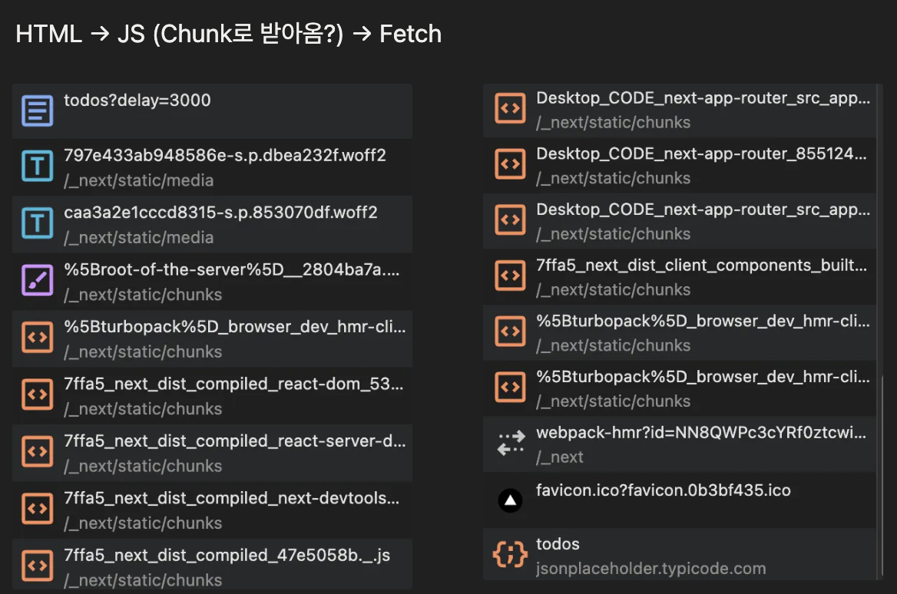
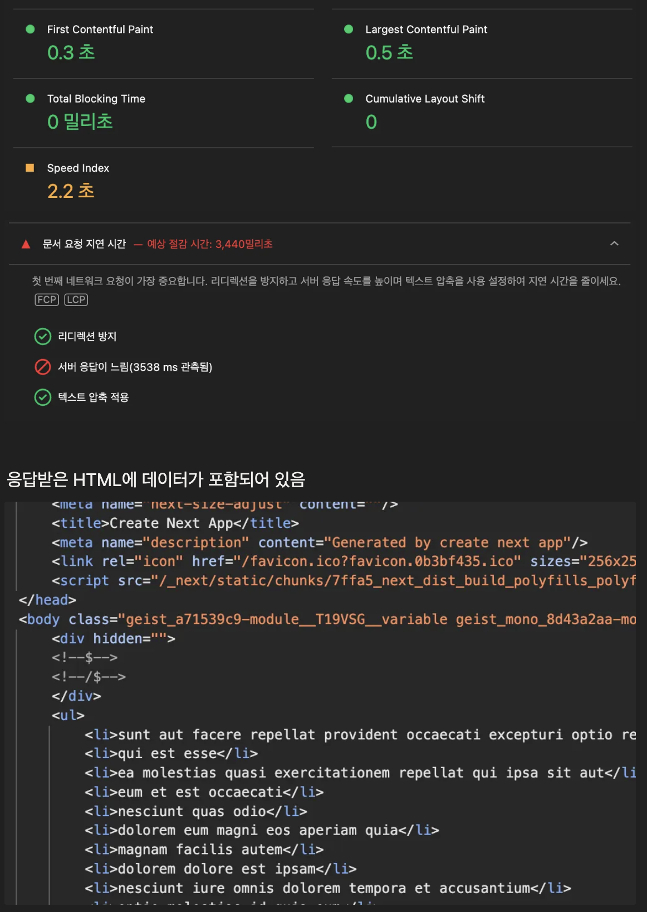

## 서버 vs 클라이언트 컴포넌트

FCP, LCP, TTI 측정

source map으로 HTML 확인 및 차이점 확인하기

### Client




### Server



## Streaming SSR

**Network 탭**

- HTML 청크 단위 전송 확인
- <template> 태그와 스크립트로 suspense boundary가 교체되는 것 확인

```html
<div>
  <h1>사용자 목록</h1>
  <!--$?-->
  <template id="B:0"></template>
  <div>사용자 목록 로딩 중...</div>
  <!--/$-->
  <h1>최근 게시물</h1>
  <!--$?-->
  <template id="B:1"></template>
  <div>최근 게시글 로딩 중...</div>
  <!--/$-->
  <h1>코멘트</h1>
  <!--$?-->
  <template id="B:2"></template>
  <div>통계 데이터 로딩 중...</div>
  <!--/$-->
</div>

<div hidden id="S:0">
  <template id="P:3"></template>
</div>
<div hidden id="S:1">
  <template id="P:4"></template>
</div>
<div hidden id="S:2">
  <template id="P:5"></template>
</div>

<div hidden id="S:5">
  <div>
    laudantium enim quasi est quidem magnam voluptate ipsam eos tempora quo
    necessitatibus dolor quam autem quasi reiciendis et nam sapiente accusantium
  </div>
</div>

<script>
  $RS("S:5", "P:5");
</script>
<script>
  $RC("B:2", "S:2");
</script>
```

$RS, $RC 함수가 script에서 선언되어 해당 함수를 통해 DOM 요소 교체한다.

**사용자 경험 비교**

- Suspense 없이 모든 데이터 await하면? → 5초 뒤 화면 표시
- Suspense 사용 → 즉시 레이아웃 표시 → 각 세션 준비되는 대로 표시

Suspense가 없으니까 청크 단위로 전송되지 않고 완성된 페이지가 한번에 온다.

**왜?**

Suspense가 없으면 페이지 전체가 하나의 거대한 async 작업으로 인지한다. 그래서 모든 async 작업이 끝나야 HTML을 보내게된다. **즉 청크를 보내되, 하나의 청크만 보낸다.**

## SSR vs CSR

### SSR

- 결국 SSR은 모든 HTML의 렌더링을 기다린 뒤 유저가 응답을 받을 수 있다. 즉, 렌더링이 오래 걸리면 그만큼 유저 응답 속도가 느려진다.
- 추가로 매번 요청마다 서버에서 렌더링 작업을 해야하기 때문에 서버에 부하가 발생한다.

- SEO 성능은 우수하다. 메타 데이터 지정 시 올바르게 작동한다.
- 클라이언트의 브라우저 성능의 영향을 줄일 수 있다.

### CSR

- 모든 JS 작업을 브라우저에서 하기 때문에 초기에 느릴 수 있다.
- SEO 성능이 좋지 않다. (빈 HTML)

- 배포하는 입장에서 정적인 자산만 올리면 되기 때문에 배포하기 간편하다.
- 따로 서버 인프라 관리를 하지 않아도 된다.

언제 사용해야할까? -> 명확한 기준이 떠오르지 않음. 일반적으로 NextJS의 방식이 더 좋아보인다.

## Page Router vs App Router

### Page Router

- 서버에서 렌더링 과정이 동기적으로 동작한다. (renderToString)
- 데이터가 항상 페이지 단위이다.

_그럼 Page Router는 MPA인가?_
-> 빌드 시 각 페이지 단위로 번들을 나눔 -> URL 마다 하나의 페이지 파일에 연결

### App Router

- HTML을 스트리밍 방식으로 보낼 수 있고, 부분 하이드레이션 기능 또한 지원한다.
- 느린 렌더링 컴포넌트가 존재하더라도 제외하고 나머지 부분을 유저가 받아볼 수 있다.

## 서버 컴포넌트와 클라이언트 컴포넌트

### 서버 컴포넌트

- DB, API, FS에 접근 시 활용하는 것에 이점이 있다. (원 서버와 같거나 가까움)
- 정적인 UI 표시 또는 SEO가 중요한 페이지

JSX로 만들어진 HTML만 전송

_이벤트 핸들러같은 건 못 다는건가?_ -> YES

### 클라이언트 컴포넌트

- useState, useEffect 등을 사용할 경우 클라이언트 컴포넌트로 분류
- 브라우저 API를 사용할 경우 클라이언트로 분류
- UI 인터렉션이 있는 경우 클라이언트로

- NEXTJS를 배포하는 방법?
